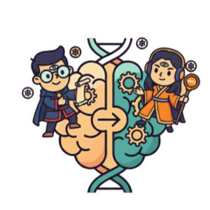

<p align="center">
  
</p>

# PsychSwap

Live Mainnet Contract: 0xE60EceE25CEC5deA5283BC00B31f7EAb102320f4

## Description

Personality Swap transforms personality tests into digital identities on-chain.  
Instead of static results that get forgotten, your MBTI type becomes a composable ERC-721 token that you can **save, share, and swap**.

## Problem

In the fast-moving world of crypto, social apps, and trends, people often make rushed decisions out of fear of missing out (FOMO).  
This leads to impulsive trades, wasted time, and regret over choices that weren’t aligned with their real personality or goals.  
There’s no fun, interactive way for people to explore their decision-making style while learning to resist FOMO.

---

## Solution

Personality Swap turns decision-making into a self-aware, gamified experience.  
Instead of following hype, users can:

- Discover their MBTI archetype and how it relates to risk behavior
- Save their personality onchain as an NFT — a permanent reminder of who they are
- Share their identity socially in a transparent way, instead of chasing trends
- Use personality insights as a tool to slow down, reflect, and avoid FOMO

This creates a playful but powerful method for making choices safer, more intentional, and less reactive.

## Features

- 🔗 Own your personality as an NFT that lives on **Base Sepolia testnet**
- 📤 Share your results directly on **Farcaster** with one click
- ⚡ Explore archetypes with **risk levels** (low, medium, high) for better insights
- 🔄 Swap or trade MBTI tokens to experiment with different perspectives
- 🌐 Interoperable across dApps, games, or social platforms

## How It Works

1. Connect your wallet
2. Take the personality test or choose your MBTI type
3. Save your result on-chain with a single click
4. Share it instantly to Farcaster
5. Swap or trade your personality with others to explore new archetypes

## Tech Stack

- **Next.js (App Router)**
- **TailwindCSS + shadcn/ui** for styling
- **wagmi + viem** for on-chain interactions
- **Coinbase OnchainKit** for wallet, identity, and social
- **IPFS via Pinata** for decentralized storage

## Local Development

```bash
# 1. Clone the repo
git clone https://github.com/your-username/personality-swap.git

# 2. Install dependencies
npm install

# 3. Set up environment variables
cp .env.example .env.local

# 4. Run the development server
npm run dev
```
